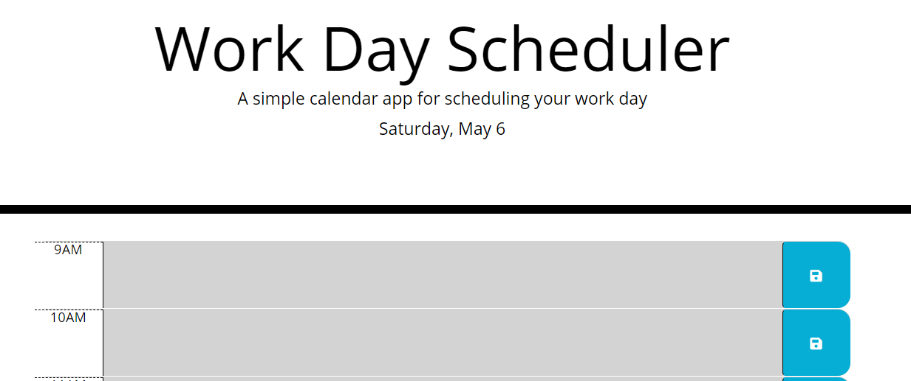
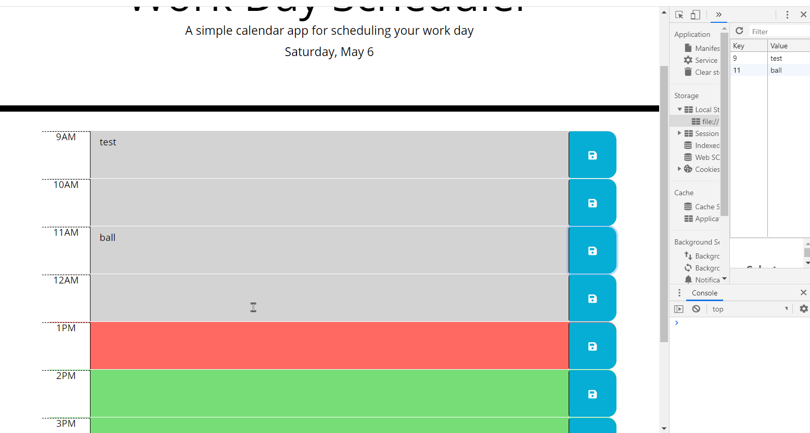
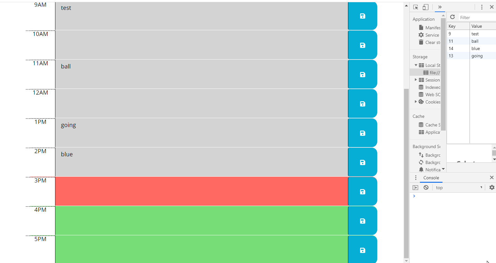

# Day-Planner

## Project Description
This is a simple calendar application that allows the user to save events for each hour of the day. The color of the hour will update as time progresses, the present hour is highlighted while past hours are grayed out and future hours are a different color. Tasks can be written within the hour blocks and saved using the blue save button on the right. These saved tasks can also be edited or removed by changing the text and clicking the save button again.

## Deployment

  [Day Planner](https://hlsorrells.github.io/Day-Planner/)

  

## Table of Contents

  * [Assignment Instructions](#assignment-instructions)
    * [User Story](#user-story)
    * [Acceptance Criteria](#acceptance-criteria)
  * [Project Lessons](#project-lessons)
    * [Initial Logic](#initial-logic)
    * [Current Date](#current-date)
    * [Time Loop](#time-loop)
    * [Local Storage](#local-storage)
  * [Screenshots of Application](#screenshots-of-application)
  * [Authors](#author)

----

## Assignment Instructions
Full instructions can be found in the README.md within the Instructions folder. Here is a summary:

Create a simple calendar application that allows the user to save events for each hour of the day. This app will run in the browser and feature dynamically updated HTML and CSS powered by jQuery. The app should display standard business hours (9 a.m. to 5 p.m.). Each time slot should represent one hour and contain the following:
    * The time
    * A field to hold user input
    * A save button

Clicking on the save button will store the time and user input in `localStorage`. Near the top of the calendar, the application should display the current day. Additionally, each hour should be color coded to reflect whether the time slot is in the past, the present, or the future. This will change depending on the time of day.

<details>
    <summary markdown="span">Click to expand Assignment Instruction Details</summary>

### User Story
AS AN employee with a busy schedule
I WANT to add important events to a daily planner
SO THAT I can manage my time effectively 

### Minimum Requirements

* Functional, deployed application.

* GitHub repository with a unique name and a README describing project.

* The application displays timeblocks for standard business hours (9 a.m. to 5 p.m.).

* Each timeblock contains an input field and save button.

* Clicking a timeblock's "Save" button stores the input text in local storage, allowing the text to persist when the application is refreshed.

* The current day is displayed at the top of the calendar.

* Each timeblock is color coded to indicate whether it is in a past, present, or future hour.

```
GIVEN that an employee adds events to a specific hour in a calendar

WHEN the employee clicks the save button

THEN events are saved in the timeblock for that hour
```
</details>
----

## Project Lessons

### Initial Logic
When given this assignment, I realized that to accomplish this task the time would have to be dealt with in military time to easily determine the current hour block. I was provided a single block of code for the individual hour rows which I had to modify for my purposes. I chose to use the id property of the parent div tag with class "time-block" which allowed me to specifically identify each hour block.

```
    <!-- Timeblocks for each hour -->
    <div id="9" class="row time-block">
```

### Current Date
The first task was to construct the current date for the last line of the jumbotron header. I searched online and found how to use the Date() with .getDay() & .getMonth() to retrieve the numeric values of the current month and day which were set to variables. In addition, I created variables for the weekday and month names arrays. This allowed me to use the numeric value of the current day and month as the index of the array to pull the alphabetic words for better presentation.

```javascript
    $('#currentDay').text(weekday[day] + ', ' + months[numMonth] + ' ' + day)
```
*Day planner header image showing date format and styling*

### Time Loop
Iteration through updating the color backgrounds of the hour blocks was a three-step process. The first step was to build a time loop function for the backgrounds. Next the function would need to be initially called when the page loaded. Finally, the setInterval function would need to recall the updateTimeBlock function every 60 seconds to ensure that as the current hour changed all of the hour block colors were updated.

<details>
    <summary markdown="span">Click to expand Time Loop Construction Details</summary>

1. Construction of the updateTimeBlock function began with grabbing the div's time-block class to iterating through each hour block individually. A variable was created for the current hour which returned a numeric value. I pulled the current div's id attribute and parsed it to an integer so I could easily compare the two numeric values. I used a conditional if/else if/else statement to set the class for the appropriate CSS property to change the background color.

```javascript
  // Current time loop function to update background colors
  function updateTimeBlock() {
    // Loop over all the .time-blocks to find current time
    $('.time-block').each(function () {
      // Get the current hour
      var currentHour = new Date().getHours()
      // Get the div's id value
      var divID = parseInt($(this).attr('id'))
      // Compare div's id value to the current hour
      if (divID === currentHour) {
        $(this).addClass('present')
      } else if (divID < currentHour) {
        $(this).addClass('past')
      } else {
        $(this).addClass('future')
      }
    })
  }
```

2. The next step was to simply call the function to load when the page was loaded.
3. A timer interval was needed to recall the function every 60 seconds to ensure that the page would update colors as time progressed. This was accomplished by using the setInterval function which called the updateTimeBlock function every 60,000 milliseconds.
</details>

### Save Button
To give functionality to the save button, I created an on-click listener for the button "saveBtn" class. I created a task variable for the text entered into the textarea div and a variable for the div's id attribute (similar to the one in the time loop). The divID variable had to be adjusted for its current location with the new function as it was not a global variable. Using the divID variable as a key and the task variable for the value, I was able to load the user's input into the local storage using the .setItem() method.

```javascript
// Listener for the save buttons
  $('.saveBtn').on("click", function () {
    // Get the text from the textarea tag
    var task = $(this).siblings('.description').val()
    // Get div id value
    var divID = $(this).parent().attr('id')
    // Store user input using key value of divID and text value of text
    localStorage.setItem(divID, task)
  })
```

### Local Storage
My last task was to retrieve the stored date from local storage to make the web app persistent. I wanted to construct a for loop to iterate through the div's id property values, but I was unable to determine a viable solution before the assignment was due. So I hard-coded the retrieval of the value of the key using the .getItem() method on the div's id property value. By making this choice, I could ensure that each hour would retrieve its corresponding data.

```javascript
  $('#9 .description').val(localStorage.getItem('9'))
  $('#10 .description').val(localStorage.getItem('10'))
  $('#11 .description').val(localStorage.getItem('11'))
  $('#12 .description').val(localStorage.getItem('12'))
  $('#13 .description').val(localStorage.getItem('13'))
  $('#14 .description').val(localStorage.getItem('14'))
  $('#15 .description').val(localStorage.getItem('15'))
  $('#16 .description').val(localStorage.getItem('16'))
  $('#17 .description').val(localStorage.getItem('17'))
```

## Screenshots of Application

*Day planner header image showing date format and styling*


*Day planner body image showing the time block coloring*


*Day planner body image showing the color change over time*

## Author

[Heather Sorrells](mailto:hlsorrells.dev@gmail.com)